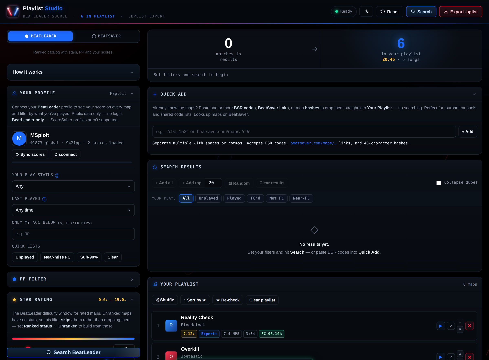
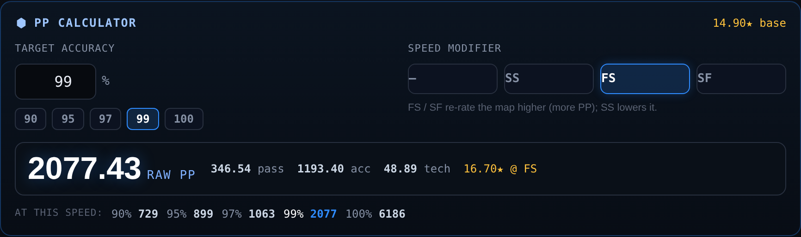
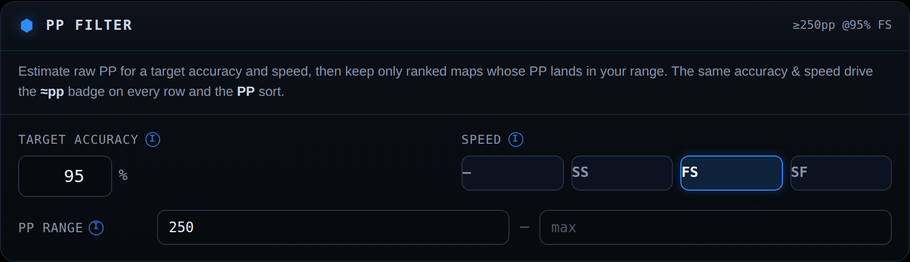

# 🎵 Playlist Studio

**A Beat Saber playlist builder that searches [BeatLeader](https://beatleader.xyz) and [BeatSaver](https://beatsaver.com).**
Filter the ranked catalog by star rating, mapper, NPS and more — or flip to the BeatSaver catalog and build by **tags** (tech, speed, genres) including unranked maps. Curate the maps you actually want, preview them in-app, see your own scores on every map, and export a ready-to-play `.bplist` — all from a single self-contained HTML file.

---

## Overview

Playlist Studio turns live map data into curated Beat Saber playlists. Instead of dumping every map that matches your filters, it works like a shopping cart: search, add the good ones to **Your Playlist**, reorder and cover it, then export. A **source switch** at the top of the filters chooses where you're searching — **BeatLeader** (the ranked catalog, with stars, PP and your scores) or **BeatSaver** (the whole catalog, browsable by **tags**, including unranked maps). Already know exactly which maps you want? Paste their **BSR codes** into **Quick Add** and skip searching entirely. It runs entirely in your browser as one HTML file — no install or build step, and no account.

> Scores and PP come from **BeatLeader** — ScoreSaber profiles aren't supported. Tag browsing and Quick Add map lookups use **BeatSaver** (which is CORS-friendly, so those need no relay). Your BeatLeader score badges still show on BeatSaver-sourced maps you've played, since they match by hash.

## Features

### Two catalogs: BeatLeader & BeatSaver
A segmented **source switch** sits at the top of the filter column:

- **BeatLeader** — the ranked/scored catalog. Star ratings, PP, ranked status, and everything tied to your connected profile. Best for building ranked grind sets.
- **BeatSaver** — the entire map catalog, browsable by **tags**. Best for unranked lists, style packs, and anything not on a leaderboard.

Switching sources swaps in the relevant filters (the BeatLeader-only Star Rating / PP / Ranked-status panels give way to the **Tags** panel and BeatSaver sort) and clears the current results, but keeps your playlist. Your choice is remembered between visits. NPS, BPM, mapper, game mode, difficulty, Quick Add, covers, and export all work identically in both modes.

### Browse by tag (BeatSaver)
In BeatSaver mode, the **Tags** panel filters the whole catalog by BeatSaver's own tags — this is where **poodle / tech / midspeed** style lists come from (poodles live under the **Tech** tag). The full official tag set is here: 7 **style** tags (Tech, Speed, Dance Style, Balanced, Challenge, Accuracy, Fitness) and the complete **genre** list, plus a custom-tag box for anything else.

- Each chip is **tri-state**: click once to **require** a tag, again to **exclude** it, again to clear.
- Sort by **Relevance, Rating, Curated, or Latest**, with an optional **curated-only** toggle.
- Combine tags with the shared **NPS / BPM / duration / mapper** filters to dial in exactly the pack you want (e.g. Tech, unranked, 7+ NPS, sorted by Rating).
- Unranked maps have no stars or PP, so those show as **UR** and the star/PP filters simply don't apply here.

### Search & filter (BeatLeader)
- **Star-rating** range and **ranked status** (ranked / unranked / nominated / qualified / all)
- **Mapper** and **keyword** search
- **Game mode** — Standard, One Saber, No Arrows, 90°/360°, Lightshow, Lawless
- **Optional difficulty filter** (Easy → Expert+) — off by default so every difficulty comes through until you want to narrow it
- **NPS, duration and BPM** bounds
- **PP range** — keep only ranked maps worth a target PP at your accuracy and speed (see below)
- **Sort by** — Stars, Tech, Acc, Pass, NPS, Duration, BPM, or **PP at your target accuracy** (in the **Search Scope & Sort** panel)
- **Adjustable scan depth** — pull anywhere from 300 up to 20,000 maps per search (quick-pick chips: 300 / 1k / 2.5k / 5k / 10k / Max), **default 2.5k**. Bigger scans dig deeper for matches — handy for wide star ranges or "unplayed" hunts — at the cost of a longer search; drop to 300 for a quick pull
- Live client-side filtering: tweak a value and the match count updates instantly, no re-search
- Press **Enter** in any filter to search; the Search button flags when your filters have drifted from your last pull
- **Collapsible filter panels** — collapse the boxes you don't use to keep the sidebar tidy; your layout is remembered between visits

### Quick Add — by BSR code, link, or hash
Already know the maps you want? Skip searching. Paste one or more **BSR codes**, **BeatSaver links** (`beatsaver.com/maps/…`), or 40-character **map hashes** — separated by spaces or commas — and Quick Add looks each up on BeatSaver and drops it straight into **Your Playlist**. Purpose-built for **tournament pools** and shared code lists, where maps arrive as a list of `!bsr` codes rather than something you'd hunt for by filter.

### Build a playlist
- Two-panel builder: **Search Results → Your Playlist** (the playlist is what gets exported)
- Add one at a time, **Add all**, **Add top N**, or **⚄ Random**
- **Reorder** (▲▼), remove, **Shuffle**, **Sort by ★** (warmup → hard)
- **Clear playlist** empties the list and resets its name, cover and sync to a fresh start — with a one-tap **Undo clear** if you didn't mean it
- **Clear results** — a separate button that empties the results and resets your filters to defaults (your playlist is kept)
- **Collapse duplicate songs** to keep one entry per song
- Build a single playlist from several different searches
- Live totals: song count, runtime, star range + average, and average NPS

### Your scores & history (connect a BeatLeader profile)
Paste your BeatLeader profile URL or ID and Playlist Studio syncs your play history — public data, no login — so you can see and build around what you've actually played:
- **★ Build from my plays** — one button turns *every map you've played* (ranked or unranked) into the results list, with no search or import needed. Then narrow with **Your play status** (e.g. **Played, not FC**), **Near-miss FC**, or **only my accuracy below X%**, and cherry-pick the ones you want into your playlist. Perfect for "make me a set of everything I haven't full-comboed yet." (The first time, it does a quick one-off re-sync to grab the song details.)
- **Score badges on every map** — your accuracy with a green **FC** / blue **passed** / dashed **NEW** marker and your rank
- **"Your plays" filter right above the results** — one-tap chips for **All / Unplayed / Played / FC'd / Not FC / Near-FC**, so "hide everything I've already played" is a single click where you're actually looking. (Not connected yet? The bar shows a one-tap link to connect.)
- **Filter by your history** — the same set is also in the profile panel, plus "only my accuracy below X%"
- **Last played** — narrow to maps you've played within the last month / 3 months / 6 months / year, or ones you *haven't* touched in **over a year** (great for rebuilding a set worth revisiting). Reads off your synced play dates and auto-disables when you're filtering for unplayed maps
- **One-tap smart lists** — Unplayed, Near-miss FC, Sub-90%
- **Sort by you** — my accuracy, my rank, date I played, or improvement potential
- **Your best in the preview** — accuracy, misses (and the would-be FC accuracy), rank, date, and a link to watch the replay
- **Playlist readout** — "you've FC'd 4 of 15 here, 91% avg"
- Scores are cached in your browser; **↻ Sync** does a fast incremental refresh afterward

### Preview before you commit
- ▶ on any row opens an in-app preview — the map rendered in [ArcViewer](https://allpoland.github.io/ArcViewer/) (notes + audio) plus a BeatSaver audio clip, with links out to BeatSaver and the full viewer.

### PP calculator (ranked maps)
Work out exactly what a score is worth before you grind it.

- **"What would 95% give me?"** — every ranked result and playlist row shows a raw-PP estimate for a target accuracy you set once (in the **PP Filter** panel). Unranked maps show nothing, because PP doesn't apply to them.
- **Full calculator per map** — open any map and dial in an exact accuracy (type it or tap 90 / 95 / 97 / 99 / 100). You get the raw PP plus the **pass / acc / tech** breakdown so you can see where the points come from.
- **Speed modifiers** — toggle **SS** (Slower), **FS** (Faster) or **SF** (Super Fast). BeatLeader re-rates a map at each speed, so the calculator swaps in that speed's pass/acc/tech ratings: FS/SF push the rating (and the PP) up, SS pulls it down. Modifiers a map isn't rated for are greyed out.
- **Accuracy reference row** — a quick 90 → 100% PP ladder for the selected speed, so you can eyeball how much each extra tenth of a percent is worth.
- **Sort by PP** — set **Sort by** to **PP @ target acc** to rank the whole result set by earning potential.

### Filter by PP

The **PP Filter** panel turns all of that into a real filter — "only show me maps worth grinding."

- Set your **target accuracy** and **speed** once (No modifier / SS / FS / SF), then give a **PP range** — a minimum, a maximum, or both. Only ranked maps whose estimated raw PP lands in that band survive; unranked maps drop out while a bound is set.
- That same accuracy and speed drive the **≈pp badge** on every row and the **PP sort**, so what you filter on is exactly what you see — flip to **FS** and the whole list re-evaluates at Faster Song, badges and all.
- A map that isn't rated for the chosen speed is skipped by the range filter (it has no PP at that speed to compare).
- The PP range, accuracy, and speed all save into **filter presets**, so "6★+ tech that pays ≥300pp at 96% FS" is one click away next time.

The math mirrors BeatLeader's server exactly: `passPP = 15.2·e^(passRating^(1/2.62)) − 30`, `accPP = curve(acc)·accRating·34`, `techPP = e^(1.9·acc)·1.08·techRating`, summed and inflated (`650·x^1.3 / 650^1.3`). It reports **raw (unweighted) PP** — the value of the play itself, before your profile's weighting.

### Covers & export
- Auto-generated neon cover art — **25 procedural styles and 13 accent palettes**, picked from a live thumbnail grid — drawn from your title and star range. The styles include a set of **Beat Saber–themed** designs: **Note Cubes**, **Saber Slash**, **Bombs**, **Obstacles**, **Note Highway**, **Cut Spark** and **Saber Trails**, alongside the abstract neon ones (Pulse, Grid, Waveform, Spectrum, Vortex, Aurora, and more).
- **Title + subtitle overlay** with adjustable **text position** (Bottom / Center / Off) and **text color** (White / Black / Gold / Green / Blue / Red). The legibility scrim flips automatically — dark behind light text, light behind dark — so the title stays readable on any art.
- **Shuffle art** reshuffles the pattern for a fresh take on the same style.
- **Custom images** — upload your own cover and your title/subtitle overlays it exactly like the generated ones. Every image you upload is saved to a reusable **icon library** so you can reapply it to other playlists (click to reuse, one tap to remove).
- **Covers travel with playlists** — save a playlist and its cover comes back with it on load, whether it's a procedural design or your own uploaded image.
- Exports a spec-compliant `.bplist`: PascalCase difficulty names, embedded Base64 cover, difficulties merged per song, and your play order preserved.

### Save, reload & import
- **Filter presets** — save filter combos you reuse (e.g. "6★ tech warmup")
- **Playlist Library** — save and reload whole playlists (cover included)
- **Session autosave** — an accidental refresh won't lose your work in progress
- **Import `.bplist`** — open an existing playlist to edit it; covers stored as either a data URI *or* raw base64 both load, for broad compatibility with community playlists
- **BeatLeader enrichment** — `↻ Fill data` fills in stars / NPS / duration / cover for imported songs by hash; `★ Re-check` re-checks every song in the playlist to catch rating recalcs

### Refine an imported (or built) playlist
Import a big list, then prune it down in place — no spreadsheet, no re-adding maps one by one. The **Refine Playlist** panel runs bulk actions on whatever's in **Your Playlist**, using the same play-history definitions as the search filters.

- **Quick actions** — one tap each: **Remove played**, **Remove FC'd**, **Keep unplayed**, **Keep near-FC**. "Import my playlist, drop everything I've already played, re-export" is a single click.
- **Any criterion, two directions** — pick a criterion and either **Remove matching** or **Keep only matching**:
  - *Play history* — played / unplayed / FC'd / played-but-not-FC / near-miss FC / my accuracy ≥ or < a threshold / not played in over a year.
  - *Difficulty* — star rating inside a min–max range (trim a mixed list down to one band).
- **Live preview** before you commit — "Matches 12 of 80 — Remove leaves 68, Keep leaves 12" — so you always see the result first.
- **One-tap Undo** restores the playlist exactly as it was if a prune wasn't what you wanted.
- Play-history tools need your BeatLeader profile connected (the panel says so and disables them until it is); the star-range tool works on any map with a rating — run `↻ Fill data` first if imported maps show no stars.

Typical uses: refresh a grind list by dropping everything you've now FC'd, thin a huge import down to just unplayed maps, keep only your sub-90% plays to practice, prune stale maps you haven't touched in a year, or cut a 10★ playlist down to the 7–8★ band.

### In-game sync (optional)
Keep a playlist you host online, and refresh it inside Beat Saber with [PlaylistManager](https://github.com/rithik-b/PlaylistManager)'s **Sync** button — no re-importing. This writes a `syncURL` into the exported file's `customData`; when the mod sees it, the playlist gets a Sync button that re-downloads the file from your address. **Off by default** — it lives in its own **In-Game Sync** panel and does nothing unless you turn it on.

- **You host the file, not Playlist Studio.** Nothing is uploaded here — the app only writes the address you paste, so your playlist stays entirely on your own hosting. (Great for keeping the tool shared without your playlists riding along.)
- **One box** — turn the panel on and paste the URL your `.bplist` will live at (e.g. `https://mysite.com/playlists/mix.bplist`). Whatever you type goes straight into `customData.syncURL`; a live hint confirms it's a valid link.
- **Round-trips on import** — open a `.bplist` that already has a `syncURL` and the box fills itself back in.
- Your URL is remembered in your browser, so re-publishing is just: edit → export → re-upload to the same spot.

> The URL must point at the **raw file** (not a web page) and stay constant. If you move or rename the hosted file later, existing copies stop syncing — keep the same path and just overwrite the file to push an update.

### Made for mobile too
- A fixed bottom **tab bar** — **Filters / Results / Playlist** with live count badges — switches between the three views so you're not scrolling one endless column. A search jumps you straight to **Results**, the **Search** button floats within easy reach while you filter, touch targets are enlarged, and map previews go full-screen.
- The desktop two-column layout is untouched; the mobile treatment only kicks in on small screens.

### Beat Saber flair
- Subtle ambient neon — note cubes and saber-light drift behind the app, the logo crosses its sabers on load, a saber **slash** sweeps across on every search, and adding a map gives a satisfying count-up and pop. The Search button and logo carry a slow idle glow.
- Everything is smooth with **no flashing or strobing**, there's a **one-tap toggle** in the top bar to turn it all off, and it automatically stays off if your device has *reduce motion* enabled.

### Clear feedback while it works
- Long scans are impossible to miss: the Search Results panel shows a Beat Saber equalizer with a **live "N of M maps" counter** and a progress bar, a slim neon bar sweeps across the top of the page, and the Search icon spins until the pull completes.

## Getting started

**Just open it.** Download **`index.html`** and open it in any modern browser (Chrome, Edge or Firefox). It's fully self-contained — the styles, cover generator, exporter and app logic are all inlined.

**Or host it on GitHub Pages.** Enable Pages for this repo (*Settings → Pages → deploy from `main`*) and open `https://<user>.github.io/<repo>/`. It works the same; the public relay pool handles CORS.

## How the connection works

BeatLeader's API doesn't send cross-origin CORS headers, so a browser can't call it directly from a file or a third-party site — it fails with *"Failed to fetch."* Playlist Studio gets around this by routing read-only public requests through a **pool of public CORS relays**, racing them and using the first that responds. Dead or slow relays are dropped automatically, and there's nothing to configure.

If you run your own CORS relay and would rather use it, point the app at it under **Search Scope & Sort → Advanced: custom relay**. (Map previews use BeatSaver and ArcViewer directly — both are CORS-friendly, so they need no relay.)

**BeatSaver mode needs no relay at all.** BeatSaver *does* send CORS headers, so tag searches (and Quick Add lookups) call it directly from your browser — which is why the whole relay/connection section disappears when you switch to the BeatSaver source.

## Installing a playlist in Beat Saber

1. Export the `.bplist` from Playlist Studio.
2. Drop it into your Beat Saber `Playlists` folder — on PC that's usually `…\Steam\steamapps\common\Beat Saber\Playlists\`.
3. In-game, refresh your song list. The [PlaylistManager](https://github.com/rithik-b/PlaylistManager) mod loads the playlist; any maps you don't have download automatically if you use playlist syncing / BeatSaver downloading.

### Keeping a playlist in sync

Want the playlist to update itself in-game whenever you change it? Turn on the **In-Game Sync** panel before exporting (see *In-game sync* above):

1. Pick where you'll host the file and let the helper build the `syncURL`, then export.
2. Upload the exported `.bplist` to that address.
3. Import it into the game once (steps above). PlaylistManager now shows a **Sync** button on that playlist.
4. To push a change later: edit it in Playlist Studio, re-export, and overwrite the file at the **same** address. Hit **Sync** in-game to pull it — the playlist (songs, title, cover) updates in place.

## Privacy

- No account, no tracking, no analytics.
- Presets, saved playlists, saved cover icons, your working session, and your connected profile + synced scores are all stored in your browser's local storage — nothing is uploaded.
- API requests hit BeatLeader and BeatSaver (public data) through a public relay; only anonymous, read-only GETs are ever sent.

## Built with

Vanilla HTML, CSS and JavaScript — no framework and no build tooling. The single `index.html` inlines the stylesheet, the canvas cover generator, the `.bplist` exporter, and the application logic.

- Map data — [BeatLeader](https://api.beatleader.xyz) (ranked catalog, scores, PP) and [BeatSaver](https://beatsaver.com) (full catalog, tags)
- Map previews — [BeatSaver](https://beatsaver.com) + [ArcViewer](https://github.com/allpoland/ArcViewer)
- Export format — [PlaylistManager](https://github.com/rithik-b/PlaylistManager)

## Credits

Made by **MSploit** — [BeatLeader profile](https://beatleader.com/u/76561199153577883)

Not affiliated with Beat Games, BeatLeader or BeatSaver.

## License

Released under the [MIT License](LICENSE).
